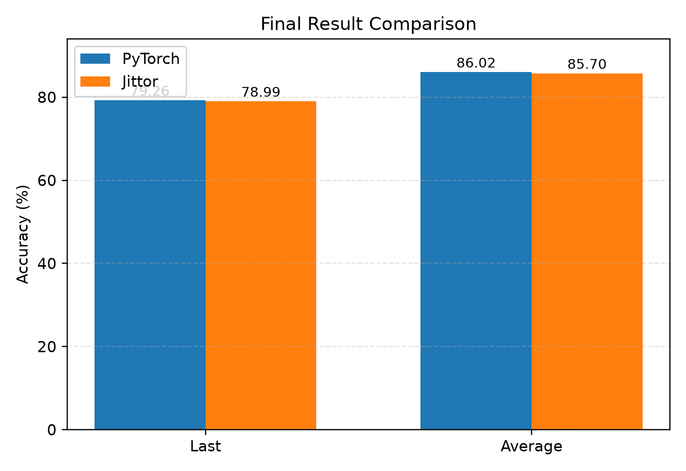
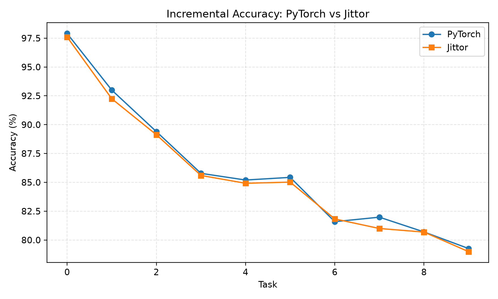
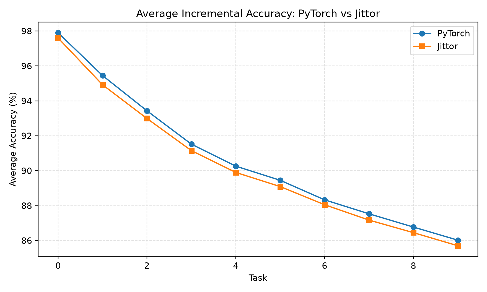
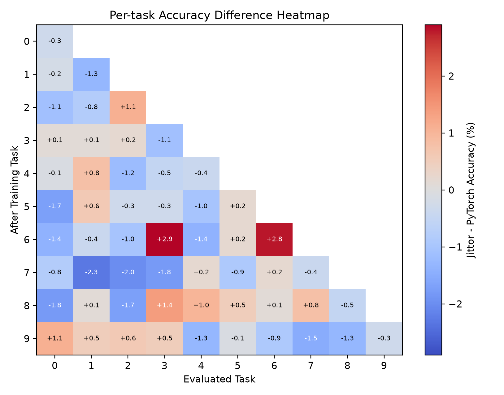
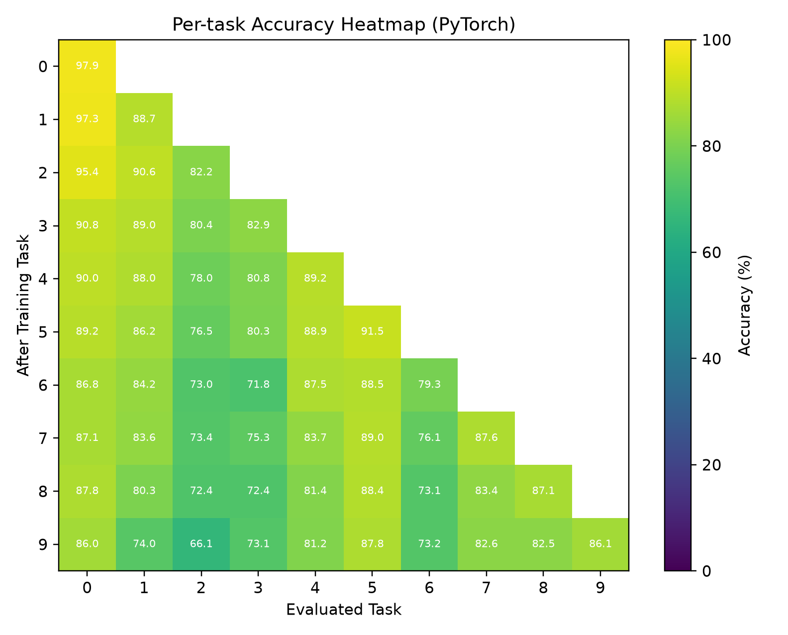
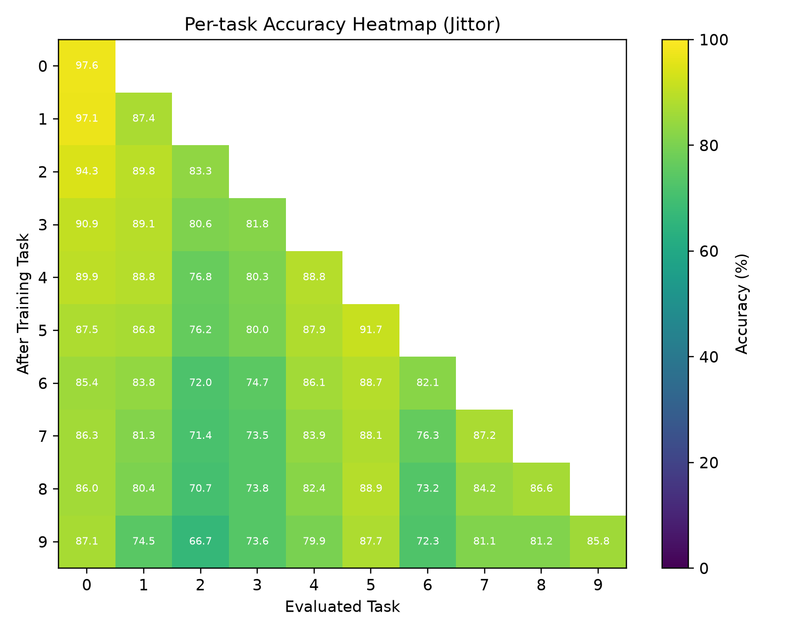

# RAPF Jittor Implementation

This repository is a Jittor implementation of **Class-Incremental Learning with CLIP: Adaptive Representation Adjustment and Parameter Fusion**.

It is **not** the official implementation. The code is modified from the PyTorch repository [linlany/RAPF](https://github.com/linlany/RAPF), with the CLIP backbone and RAPF class-incremental training pipeline migrated to Jittor.

## What Is Included

- Jittor CLIP ViT-B/16 forward inference implementation.
- OpenAI CLIP `.pt` to Jittor `.npz` conversion tool.
- Jittor RAPF model with adapter training, old-class feature sampling, hard-pair hinge loss, and parameter fusion.
- CIFAR100 class-incremental data pipeline for the 10-10 setting.
- Training scripts and plotting tools.
- Selected PyTorch vs Jittor comparison figures.

Large files are intentionally not included:

- CIFAR100 dataset
- OpenAI CLIP `.pt` checkpoint
- Converted Jittor `.npz` checkpoint
- Full experiment logs

## Repository Structure

```text
continual_clip/
  jittor_clip/              # Jittor CLIP implementation
  jittor_models.py          # Jittor RAPF model
  jittor_datasets.py        # CIFAR100 class-incremental data pipeline
  jittor_metrics.py         # Incremental metric logger
  utils.py

configs/class/
  cifar100_10-10.yaml

class_orders/
  cifar100_order.yaml

scripts/
  prepare_cifar100.py
  train_jittor_cifar100_debug.py
  train_jittor_cifar100_full.py
  test_jittor_smoke.py

tools/
  convert_openai_clip_to_jittor.py
  plot_metric_comparison.py
  plot_rapf_experiment_report.py

docs/
  figures/                  # Selected result figures
  results/                  # Selected metric JSON files
```

## Environment Setup

Create and activate a Python environment, then install the Jittor dependencies:

```bash
pip install -r requirements_jittor.txt -i https://pypi.tuna.tsinghua.edu.cn/simple
```

The tested Jittor run used:

```text
Python 3.12.4
Jittor 1.3.10.0
GPU: NVIDIA GeForce RTX 3080 Ti
```

For GPU training, run scripts with:

```bash
use_cuda=1 python ...
```

## Prepare CIFAR100

The dataset root used by default is:

```text
data/cifar100
```

You can prepare CIFAR100 manually by downloading the Python version from the official CIFAR website and extracting it to:

```text
data/cifar100/cifar-100-python
```

The expected structure is:

```text
data/cifar100/
  cifar-100-python/
    train
    test
    meta
```

You can also use:

```bash
python scripts/prepare_cifar100.py
```

## Prepare CLIP Weights

Download the OpenAI CLIP ViT-B/16 checkpoint and place it at:

```text
~/.cache/clip/ViT-B-16.pt
```

Then convert it to the Jittor `.npz` format:

```bash
python tools/convert_openai_clip_to_jittor.py \
  --input ~/.cache/clip/ViT-B-16.pt \
  --output ~/.cache/clip/ViT-B-16-jittor.npz
```

The Jittor CLIP loader expects:

```text
~/.cache/clip/ViT-B-16-jittor.npz
```

## Run Jittor RAPF

Smoke test:

```bash
python scripts/test_jittor_smoke.py
```

Debug training:

```bash
use_cuda=1 python scripts/train_jittor_cifar100_debug.py
```

Full CIFAR100 10-10 training:

```bash
use_cuda=1 python scripts/train_jittor_cifar100_full.py
```

The full script runs:

```bash
python main_jittor.py \
  --config-path configs/class \
  --config-name cifar100_10-10 \
  class_order=class_orders/cifar100_order.yaml \
  dataset_root=data/cifar100 \
  +use_cuda=1
```

## Key Hyperparameters

| Item | Value |
|---|---:|
| Backbone | CLIP ViT-B/16 |
| Dataset | CIFAR100 |
| Setting | Class-Incremental 10-10 |
| Number of tasks | 10 |
| Classes per task | 10 |
| Epochs | 15 |
| Train batch size | 100 |
| Eval batch size | 128 |
| Learning rate | 0.001 |
| LR milestones | `[4, 10]` |
| Optimizer | Adam |
| Seed | 2 |
| beta | 2 |
| mix_bias | 0.6 |
| threshold | 0.55 |
| shrinkage | false |

## Results

The following results compare the migrated Jittor implementation against the PyTorch baseline from the original code path.

| Method | Last Acc | Avg Acc |
|---|---:|---:|
| PyTorch RAPF | 79.26 | 86.02 |
| Jittor RAPF | 78.99 | 85.70 |

### Final Accuracy



### Incremental Accuracy



### Average Incremental Accuracy



### Per-task Accuracy Difference

Each cell is `Jittor accuracy - PyTorch accuracy`.



### Per-task Accuracy Heatmaps

PyTorch:



Jittor:



Additional accuracy and loss figures are available in `docs/figures/`.

## Notes

- This repository focuses on the Jittor migration for the CIFAR100 10-10 class-incremental setting.
- Forward transfer (`fwt`) is kept as a simplified placeholder in the Jittor metric logger.
